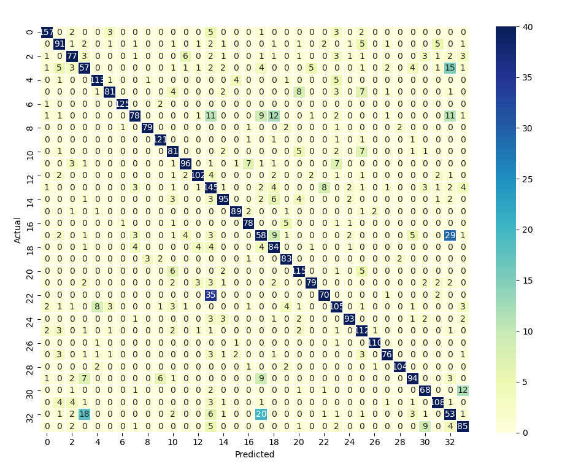

# tensorflow-ml-project

## Introduction

Recognizing various forms of land use via satellite imaging is an important means of measuring urban spread and human development. Using Tensorflow Keras, this project will use satellite images of urban, sub-urban, and natural settings to classify land use (e.g. freeway, agriculture, forest, etc.). 

The ultimate goal of this project is to take high-definition orthoimagery and accurately generate statistics on land use.

## How to Run

First, use pip to install the necessary dependencies. Anaconda is recommended. Dependencies can be found under *files/dependencies.txt*

    pip install opencv-python tqdm numpy tensorflow keras matplotlib pandas seaborn gdown

To access and run individual models, see pipeline.py. A Dockerfile will soon be available. Note that all training and code was done on/written for Tensorflow CPU. 

If `inputs.gdrive()` fails, [rawdata folder can be found here.](https://drive.google.com/drive/folders/1UiFahqZ6tMJ87jgA8hByfcJc-E_TPM_b?usp=sharing) Extract under `/files`.

## Data

The first part of our dataset comes from the [UC Merced Land Use Dataset](http://weegee.vision.ucmerced.edu/datasets/landuse.html) which has 256x256 resolution images manually taken from the USGS National Map Urban Area Imagery collection. Images come from various sites across the United States. Each pixel represents one square foot. There are a total of 21 classes with 100 images per class for a total of 2,100 images.

Citation: *Yi Yang and Shawn Newsam, "Bag-Of-Visual-Words and Spatial Extensions for Land-Use Classification," ACM SIGSPATIAL International Conference on Advances in Geographic Information Systems (ACM GIS), 2010.*

The second part of our dataset comes from the [NWPU-RESISC45 dataset](http://www.escience.cn/people/JunweiHan/NWPU-RESISC45.html) which also has 256x256 resolution images created by the Northwestern Polytechnical University (NWPU). Images come from over 100 countries and a variety of regions. Within this dataset is 45 different classes with 700 images per class for a total of 31,500 images. From the NWPU-RESISC45 dataset a few classes (e.g. palace, church, cloud, etc.) were omitted for being either irrelevant or too specific. Others, such as industrial and commericial, were combined for their similarities. Cloud detection was not needed given the high-resolution preprocessed orthoimagery input.

Citation: *G. Cheng, J. Han, X. Lu. Remote Sensing Image Scene Classification: Benchmark and State of the Art. Proceedings of the IEEE.*

The third part of our dataset comes from [senseFly](https://www.sensefly.com/education/datasets/?dataset=1502). Only a few hundred images were taken from the agricultural and airport datasets to bolster our image count.

In the end, there are a total of 26,920 images in our dataset with 34 classes as follows:

* agricultural    
* airplane        
* baseballdiamond 
* basketballcourt 
* beach
* bridge
* chaparral       
* denseresidential
* desert
* forest
* freeway
* golfcourse
* harbor
* industrial
* intersection
* island
* lake
* mediumresidential
* mobilehomepark
* mountain
* overpass
* parkinglot
* powerstation
* river
* roundabout
* runway
* seaice
* ship
* snowberg
* sparseresidential
* stadium
* storagetanks
* tenniscourt
* trackfield

## Data Processing & Models
For our baseline model a 7 layer grayscale CNN was used with resized 150x150 inputs. The accuracy achieved was about 42%. The next step was an RGB colour model using the same input format but with a few more convolutional layers. The accuracy was slightly better at 58%. To increase accuracy, data augmentation was used for the colour model but with little success or difference in outcomes. This was likely because certain classes (e.g. industrial and dense residential) have too many similar features. Augmentation is used to generate more data for enhanced feature extraction; however, given the similar key features of several classes, classification rather than feature extraction was likely the issue. 

For both CNN models the optimizer used was Adam and activations were all ReLU (softmax for classification layer). Different optimizers (Adamax, RMSprop, Adagrad) did not significantly vary the accuracy. Around 7 epochs is where overfitting began to occur, but we have not yet implemented an early callback function. The training/testing split was around 85% and 15%, with validation being 10% of the training set. Dropout layers between the final dense layers were used with parameters 0.3.

The respective model summaries are as follows:

### Grayscale
    _________________________________________________________________
    Layer (type)                 Output Shape              Param #   
    =================================================================
    conv2d_1 (Conv2D)            (None, 148, 148, 32)      320       
    _________________________________________________________________
    max_pooling2d_1 (MaxPooling2 (None, 74, 74, 32)        0
    _________________________________________________________________
    conv2d_2 (Conv2D)            (None, 72, 72, 32)        9248      
    _________________________________________________________________
    conv2d_3 (Conv2D)            (None, 70, 70, 32)        9248      
    _________________________________________________________________
    max_pooling2d_2 (MaxPooling2 (None, 35, 35, 32)        0
    _________________________________________________________________
    flatten_1 (Flatten)          (None, 39200)             0
    _________________________________________________________________
    dense_1 (Dense)              (None, 128)               5017728   
    _________________________________________________________________
    dense_2 (Dense)              (None, 34)                4386      
    =================================================================
    Total params: 5,040,930
    Trainable params: 5,040,930
    Non-trainable params: 0
    _________________________________________________________________
   
### Colour

    _________________________________________________________________
    Layer (type)                 Output Shape              Param #
    =================================================================
    conv2d_1 (Conv2D)            (None, 148, 148, 32)      896
    _________________________________________________________________
    max_pooling2d_1 (MaxPooling2 (None, 74, 74, 32)        0
    _________________________________________________________________
    conv2d_2 (Conv2D)            (None, 72, 72, 32)        9248
    _________________________________________________________________
    conv2d_3 (Conv2D)            (None, 70, 70, 32)        9248
    _________________________________________________________________
    max_pooling2d_2 (MaxPooling2 (None, 35, 35, 32)        0
    _________________________________________________________________
    conv2d_4 (Conv2D)            (None, 33, 33, 64)        18496
    _________________________________________________________________
    max_pooling2d_3 (MaxPooling2 (None, 16, 16, 64)        0
    _________________________________________________________________
    flatten_1 (Flatten)          (None, 16384)             0
    _________________________________________________________________
    dense_1 (Dense)              (None, 128)               2097280
    _________________________________________________________________
    dropout_1 (Dropout)          (None, 128)               0
    _________________________________________________________________
    dense_2 (Dense)              (None, 34)                4386
    =================================================================
    Total params: 2,139,554
    Trainable params: 2,139,554
    Non-trainable params: 0
    _________________________________________________________________

Lastly, the VGG19 model with preloaded weights was used for transfer learning. None of the Imagenet classes were trained on satellite images (an input of "airplane" yielded "nematode") so only the convolutional layers were kept. A 256 neuron dense layer was appended after passing all input through the VGG19 CNN. This resulted in a significantly better 80% accuracy. Compared to other benchmarks found on Github and elsewhere for non-CapsNet convolutional deep learning models trained on satellite images, this is quite good. 

### VGG19 Top Layer

    _________________________________________________________________
    Layer (type)                 Output Shape              Param #
    =================================================================
    flatten_1 (Flatten)          (None, 25088)             0
    _________________________________________________________________
    dense_1 (Dense)              (None, 256)               6422784
    _________________________________________________________________
    dropout_1 (Dropout)          (None, 256)               0
    _________________________________________________________________
    dense_2 (Dense)              (None, 34)                8738
    =================================================================
    Total params: 6,431,522
    Trainable params: 6,431,522
    Non-trainable params: 0
    _________________________________________________________________

The next step for model training is to implement Google's Inception V3 network, which should have a better accuracy due to less data loss. Our models were forced to use a significant amount of maxpooling with fewer convolutional layers due to a restriction on computing power. Passing all the data through VGG19's convolutional layers alone required up to four hours of computing time. Inception layers may also help resolve the size disparity between buildings and especially between streets and tennis courts (discussed below). Beyond Inception V3, a CapsNet network using Inception V3 is also on the agenda. It is unlikely that bounding boxes or Mask RCNNs will be implemented on this given the nature of satellite images—altitude and resolution make classifying different sizes of, say, housing communities or industrial developments after resizing not a feasible or effective tool. 

### Limitations and Error

In order of most to least mismatches:

1. powerstation → industrial
2. medium residential → tennis court*
3. tennis court → basketball court*
4. stadium → trackfield*
5. dense residential → mobile homes, industrial, medium residential
6. sparse residential → medium residential

**and vice versa*

The confusion between dense residential, medium residential, powerstations, and industrial is pretty self-explanatory: they all look the same, even to a human. We believe that medium residential was often confused with tennis courts and tennis courts with basketball courts due to the shared feature of "curved white lines." A CapsNet or Inception model may be better at identifying the finer differences between the two compared to VGG, especially with its heavy maxpooling. Most other confusions can be explained by exceedingly similar characteristics. 

The greatest limitation is in scale and resolution. Currently, each pixel represents one square foot (0.3x0.3 meters) of space, however not all satellite images use this. Other satellite bands and sensors measure different wavelengths of light and have significantly varied input. It is beyond the scope of this project to incorporate these features, but there are obvious features to be found in different satellite spectral images. High-resolution orthoimagery involves only heavily "cleaned-up" data:

*An orthoimage is a uniform-scale image where corrections have been made for feature displacement such as building tilt and for scale variations caused by terrain relief, sensor geometry, and camera tilt. A mathematical equation based on ground control points, sensor calibration information, and a digital elevation model is applied to each pixel to rectify the image to obtain the geometric qualities of a map.* (USGS EROS Archive)

### Disclaimer

This project was intended as an introduction to machine learning constructed by high school students; it is far from scientifically rigorous. Please use these models or files as sample code, but the inaccuracies are still quite high. 

Project by: Kevin Tong and Devin Lin

Last Updated May 2020. 

### References

Marcello, J. (2019). Very High Resolution (Vhr) Satellite Imagery. (F. Eugenio, Ed.). S.l.: MDPI AG.

USGS EROS Archive - Aerial Photography - High Resolution Orthoimagery (HRO). (n.d.). Retrieved May 8, 2020, from https://www.usgs.gov/centers/eros/science/usgs-eros-archive-aerial-photography-high-resolution-orthoimagery-hro

Special thanks to Ke Deng for his help and support.